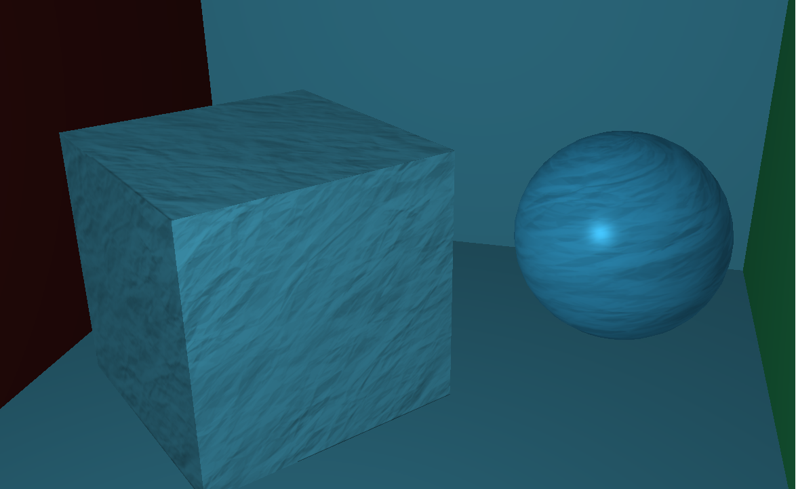

# Implementation of Phong Rendering Model


##1. About

co-authored with my classmate Pingchuan Ma.

This implementation is based on OpenGL.

My visual studio version is VS2015

## 2. How to use

First, compile the project again

Second, execute the following command line to run the program

```
phong /path/to/obj_file
```

or, simply click 'execute' in visual studio, which will execute with the default obj file.

After execution started:

(1) move your mouse to change the view direction

(2) roll the mouse wheel to zoom in and zoom out

(3) move view point by key board ('w' button for moving forward, 's' for backward, 'a' for left, 'd' for right)


## 3. Result

