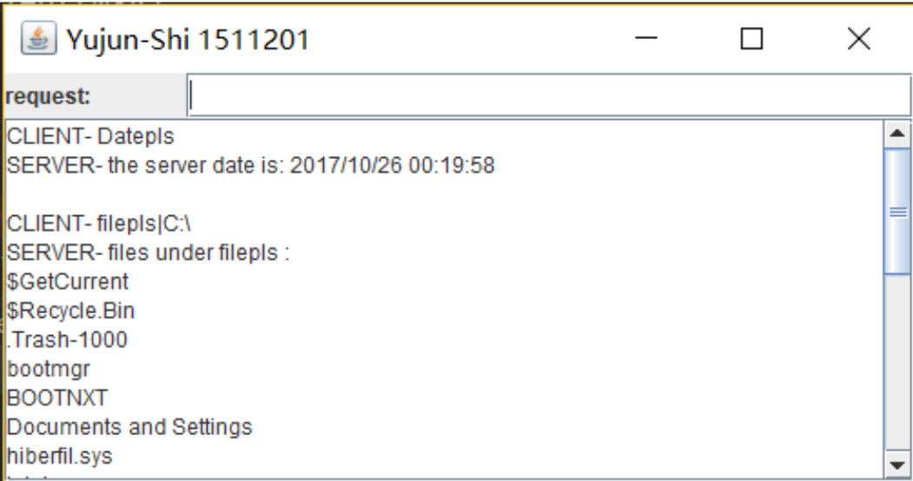

# A Simple Client-Server Program Based on UDP Socket


##1. About

It's a very client-server program.


## 2. How to Execute

First, execute the two jar file by:

```bash
java -jar Server.jar
```

and 

```bash
java -jar UDPClient.jar
```

Then, on the "UDPClient" interface, input "Datepls" to get the local date of the server and "filepls|(path-to-a-folder-on-server-side)" to get all the file names under a folder of the server.


## 3. Result

 