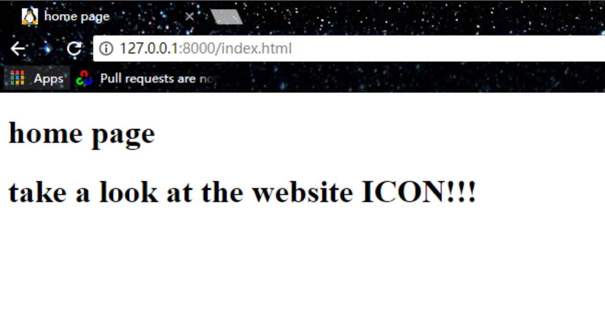

# A Simple Web Server


## 1. About

This is a simple web server implemented in java


##2. How to Use

First, execute the jar file by:

```bash
java -jar Webserver.jar
```

Then, open the browser and input the server address

```
http://127.0.0.1:8000/index.html
```

There, you can see the displayed html file

Also, change the "index.html" to other thing (such as "bear.gif" and "dirk.jpg") to view other stuff under the server folder.


## 3. Result

