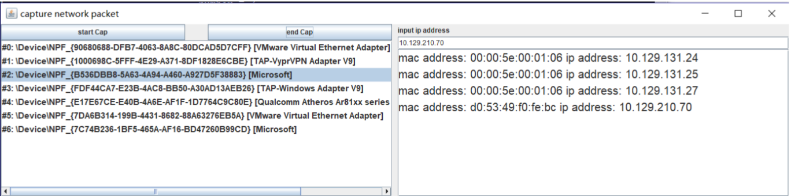

# Experiments on ARP Protocol


## 1. About

This experiment is implemented based on jnetpcap using java.  


## 2. How to Use

First, execute the following command line

```
java -jar ARPAnalyzer.jar
```

Then, in the user interface, input the IP address that you want to resolve and click "start cap"

After that, the corresponding MAC address shall be displayed.


## 3. Result



