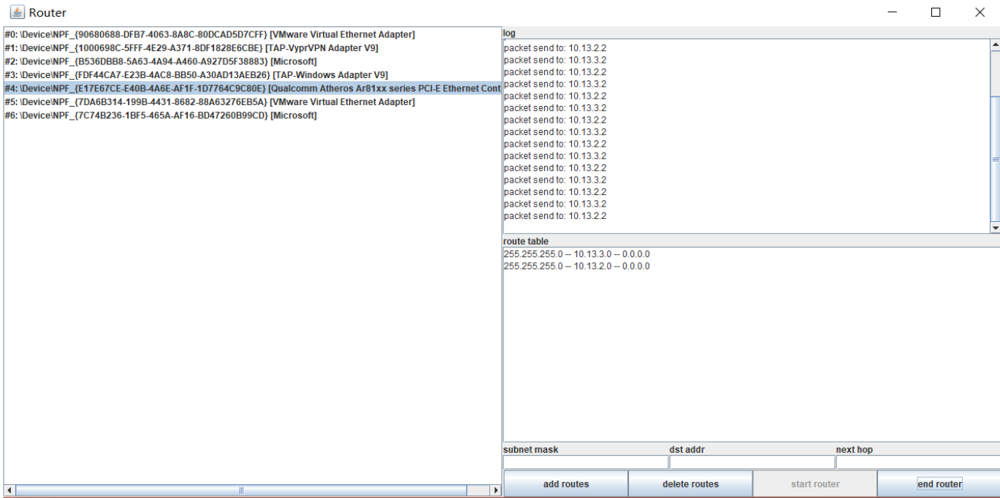

# A Simple Router

## 1. About

This is a simple router implemented based on jnetpcap.

##2. How to Use 

First, configure IP address on at least three machines.

Second, execute the eclipse project on one of the machine (it has to be a node in the middle).

Third, manually add the route table and then click "start router"

Finally, use "ping" command to test the router. If the data packets go through the router, then the dispatch information shall be displayed.

## 3. Result

