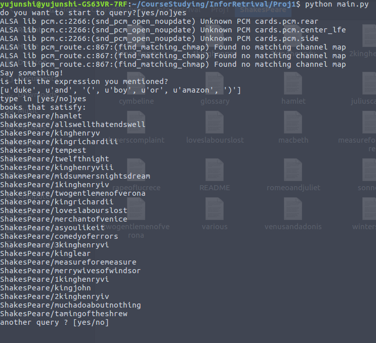

# Implementation of Boolean Retrieval


## 1. About

Boolean retrieval is to input a boolean query and find all files in the database that satisfied. I used python to implement this project. It supports voice query input (Service provided by Houndify)


##2. How to use

First, start the execution of the program by

```bash
python main.py
```

After that, you can input your voice query.

For boolean expression like the following

```
( boy | amazon ) & ~ exit
```

means the document should have the word "boy" or "amazon" and should not have the word "exit".

To input it in voice query, you simply have to say the following to your microphone:

```
left boy or amazon right and not exit
```

After the voice input, the program will ask the user if the obtained expression is correct. If the user type "yes", then the execution proceed. If the user type no, then the program will ask the user to input the expression like this:

```
 ( boy or amazon ) and not exit
```


## 3. Result

