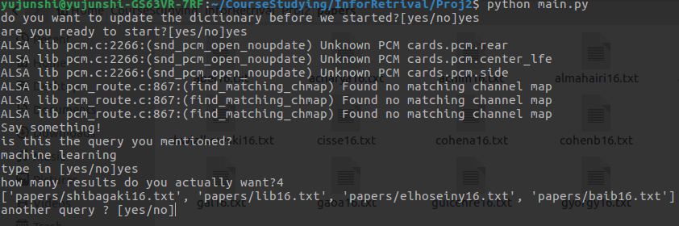

#A Simple Academic Retrieval System With Vector Space Model


##1. About

This program is simple academic retrieval system implemented in python. The user can input a query and the system will find the paper that is relevant to the input query and display it in the order of score. The system is based on inverted index and used tf-idf weighting. The system also support voice input (service provided by Houndify)


##2. How to Use

First execute the program by:

```bash
python main.py
```

Then, input your voice query to your microphone.

After that, the program will double check with you to see if it got the query right. If the user type "no", then, it will require the user to type the query.


## 3. Result

